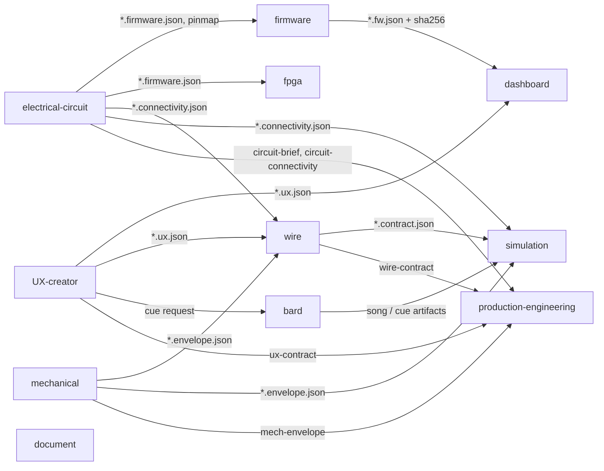
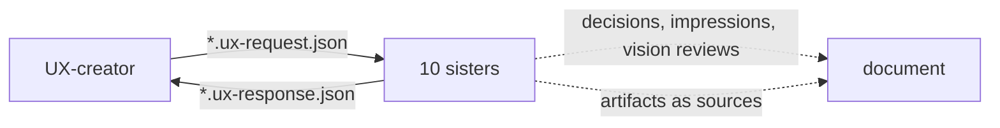

# Agent handoffs in the VibeBB family

[English](#english) | [日本語](#日本語)

## English

This page is the map of artifacts that actually flow between the eleven
VibeBB agents today. Every arrow is backed by code on the `main` branch of
the receiving repository: an import kind, a liaison file, or a contract
field. Planned handoffs are listed separately and move into the map only
when their code lands.

### Rules every handoff follows

- **Artifacts, not imports.** Sisters exchange JSON files in the shared
  workspace. No agent imports another agent's code or edits another
  agent's inputs; a change goes back as a request.
- **Pinned by hash.** The receiver records the producer artifact's
  `sha256`. A changed upstream file is detected, never silently reused.
- **Gates decide.** Only the receiver's deterministic gates issue a
  verdict. Impressions, vision reviews and songs travel with the artifact
  as advisory evidence and never change a verdict.
- **Unknown fails closed.** A missing, unparseable or stale input makes
  the dependent gate `unknown`, which fails the design verdict.
- **Nothing waits.** Records reference only records that already exist;
  no agent blocks waiting for a sister. Missing input is recorded as
  unresolved and work continues (VRP, below).

### Design artifacts

| From | To | Artifact | Where the receiver binds it |
| --- | --- | --- | --- |
| circuit | firmware, fpga | `*.firmware.json` (pins, buses, clocks) | firmware / fpga contract import |
| circuit | wire, sim | `*.connectivity.json` (nets, connector pins) | wire `imports`, sim `ImportRef.system` |
| mechanical | wire, sim | `*.envelope.json` (fixing points, keep-outs) | wire `imports`, sim `ImportRef.system` |
| wire | sim | `*.contract.json` | sim `ImportRef.system` |
| bard | sim | song and cue artifacts | sim `ImportRef.system` |
| firmware | dashboard | `*.fw.json` with `firmware_sha256` | dashboard `firmware_contract` |
| UX | dashboard, wire | `*.ux.json` | contract import |
| circuit, mechanical, wire, UX | production-engineering | brief, connectivity, envelope, contracts | prodeng `ImportRef.kind` |

### Coordination: liaison (SLP v2) and records (VRP)

- **Sister Liaison Protocol (SLP v2).** UX-creator writes requests into
  each sister's `liaison/` inbox; the sister answers with a response file
  that its guard hook protects. UX-creator detects circular request
  chains, so a request cannot bounce forever.
- **VibeBB Record Protocol (VRP).** Each agent appends decisions, stage
  impressions and vision reviews to `observations/<agent>/*.jsonl`. The
  Stop hook refuses to end a session that owes a record at most twice,
  then allows the stop and records what was missing.
- **document** reads sister agents, their artifacts and their records as
  typed sources for reports and launch material.

### Planned handoffs (not on `main` yet)

These are implemented repository by repository. Each moves into the
diagrams above when its code is merged.

| From | To | Artifact |
| --- | --- | --- |
| circuit | mechanical | board outline, connector positions, component heights (IDF / STEP) |
| mechanical | circuit | height limits and connector openings from the enclosure |
| mechanical | simulation | drop, vibration and IP study requests |
| circuit | simulation | per-part dissipation for the thermal model |
| circuit | production-engineering | test points (DFT), derating, alternates, PCB fabrication and assembly specifications |
| mechanical, circuit | wire | 3D route check against keep-outs and connector positions |
| bard | firmware | `cues.json` playback table, buzzer frequency response and SPL limits |
| fpga | firmware | register map, multi-corner timing, power estimate |
| fpga, firmware | production-engineering | programming procedure, bitstream / image sha256, factory test commands |
| simulation | circuit, mechanical | margin-driven change requests (direct, not via UX) |
| UX | mechanical, production-engineering | industrial-design form, out-of-box experience for packaging |
| all | all | engineering change request / order (ECR / ECO) and AI design reviews |
| impressions | UX, bard, all sisters | read receipts, UX impression digest, bard songs delivered to sisters (VRP v2) |

## 日本語

このページは、11のVibeBB agentの間で、今実際に流れている成果物の地図です。
矢印はすべて、受け取る側のrepositoryの `main` にあるコード（取り込みの種類、
liaisonのファイル、contractの欄）で確かめたものです。計画中の受け渡しは別の
表に分けてあり、コードがmergeされた時点で図に移します。

### すべての受け渡しが守る決まり

- **コードではなく成果物で渡す**: 姉妹agentは、共有workspaceのJSONファイルを
  やり取りします。他のagentのコードをimportしたり、入力を書き換えたりはしません。
  変更が必要な時は依頼として返します。
- **hashで固定する**: 受け取る側は、作成側の成果物の `sha256` を記録します。
  元のファイルが変われば検出され、黙って使い回されることはありません。
- **判定はゲートだけが行う**: 判定を出すのは、受け取る側の決定論ゲートだけです。
  impression、vision review、うたは参考情報として成果物と一緒に渡り、判定を
  変えることはありません。
- **不明は不合格として扱う**: 入力が無い、読めない、古い場合、その入力を使う
  ゲートは `unknown` になり、設計の判定は不合格になります。
- **待たない**: 記録が参照するのは、すでに存在する記録だけです。姉妹の返事を
  待って止まるagentはありません。足りない入力は未解決として記録し、作業を
  続けます。

図と表は英語の節を見てください。計画中の受け渡し（circuit → mechの基板外形と
部品高さ、bard → firmwareのcue再生、fpga → firmwareのレジスタマップ、設計変更
（ECR/ECO）など）は、repositoryごとに実装し、mergeされた順に図へ移します。
